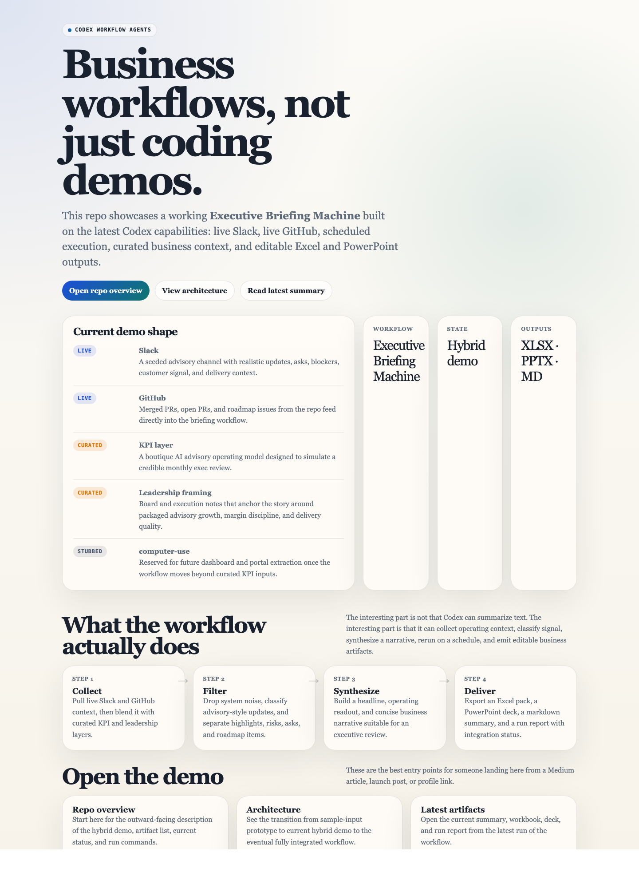

# Codex Workflow Agents

Working demo repo for a user-facing business workflow built on top of the latest Codex capabilities.

[](https://laksh-star.github.io/codex-workflow-agents/)

The current repo centers on one live hybrid demo:

- `Executive Briefing Machine`

It combines:

- live Slack context
- live GitHub context
- curated business KPI data
- curated leadership framing
- scheduled reruns
- editable Excel and PowerPoint outputs

The current demo storyline is based on **Directing Business Consulting Advisory**, a boutique AI consulting and advisory firm.

## Demo status

This repo is best understood as a **hybrid workflow demo**.

| Source | Status | Purpose |
| --- | --- | --- |
| Slack | Live | Advisory updates, asks, blockers, customer signal |
| GitHub | Live | PRs, issues, and roadmap signal |
| KPI data | Curated | Boutique AI advisory operating metrics |
| Leadership notes | Curated | Board and execution framing |
| Teams | Stubbed | Not wired yet |
| `computer-use` dashboards | Stubbed | Architectural path exists, live capture does not |

This makes the repo useful and honest: it demonstrates a real workflow with live connectors where they matter most, while keeping the remaining business context curated for output quality.

## What the demo produces

Each run generates:

- an editable Excel KPI pack
- an editable PowerPoint briefing deck
- a markdown executive summary
- a run report showing integration status and demo boundaries

Latest demo artifacts:

- [Executive Briefing Demo Workbook](outputs/executive-briefing-machine-demo/executive-briefing-demo.xlsx)
- [Executive Briefing Demo Deck](outputs/executive-briefing-machine-demo/executive-briefing-demo.pptx)
- [Executive Briefing Demo Summary](outputs/executive-briefing-machine-demo/briefing-summary.md)
- [Executive Briefing Demo Run Report](outputs/executive-briefing-machine-demo/demo-run-report.md)

## Start here

- [Landing page](https://laksh-star.github.io/codex-workflow-agents/)
- [Architecture](docs/architecture.md)
- [Executive Briefing Machine demo](demo/executive-briefing-machine/README.md)
- [Setup](SETUP.md)
- [Testing](TESTING.md)

## What is implemented

- live Slack ingestion with consulting-aware filtering
- live GitHub ingestion for merged PRs, open PRs, and roadmap issues
- reusable orchestration and synthesis pipeline under `src/executive-briefing/`
- scheduled runner for recurring briefing refreshes
- editable Excel and PowerPoint generation
- integration tests for ingestion, synthesis, and output generation

## What is not implemented yet

- live KPI ingestion from a source-of-truth spreadsheet, warehouse, or BI tool
- live leadership notes from a thread or document source
- live Teams ingestion
- live `computer-use` dashboard capture
- outbound Slack or Teams delivery of the finished briefing

## Run locally

```bash
npm test
npm run build:executive-demo
npm run run:scheduled-executive-demo
```

Optional live environment variables:

```bash
SLACK_BOT_TOKEN=...
SLACK_CHANNEL_IDS=C12345678,C23456789
GITHUB_TOKEN=...
GITHUB_OWNER=Laksh-star
GITHUB_REPO=codex-workflow-agents
```

## Repo structure

```text
docs/
  architecture.md
  index.html
demo/
  executive-briefing-machine/
outputs/
  executive-briefing-machine-demo/
scripts/
src/
tests/
```

## Additional context

The original broader strategy package for non-coding workflow agents is still included in the repo:

- [Use Case Matrix](docs/use-case-matrix.md)
- [Positioning](docs/positioning.md)
- [Prompt Templates](docs/prompts.md)
- [Workflow Prioritization Workbook](outputs/product-strategy/codex-non-coding-workflows.xlsx)
- [Strategy Deck](outputs/product-strategy/codex-non-coding-workflows.pptx)

## GitHub Pages

The static landing page lives at [docs/index.html](docs/index.html).

If GitHub Pages is enabled for the `docs/` folder on `main`, that page can be used as the public entry point for articles, launch posts, or demos.
