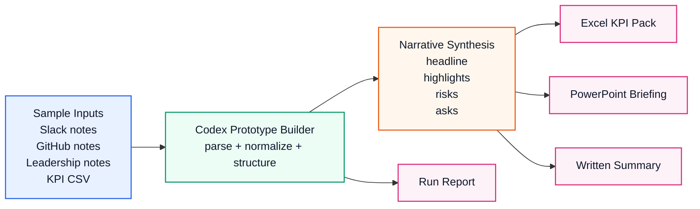
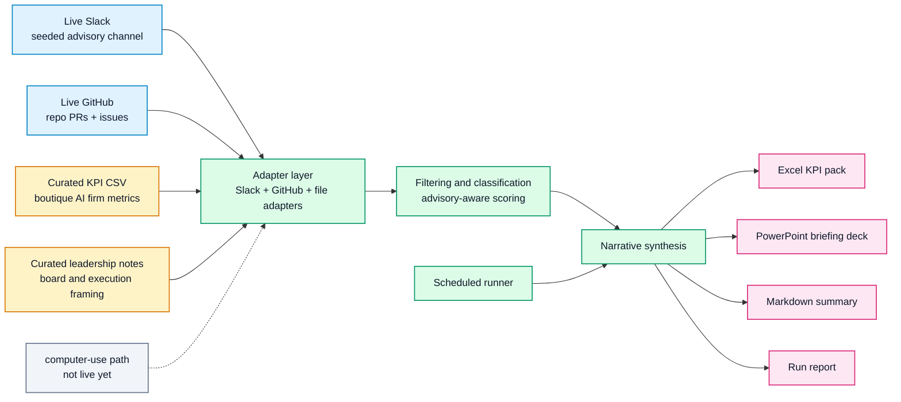
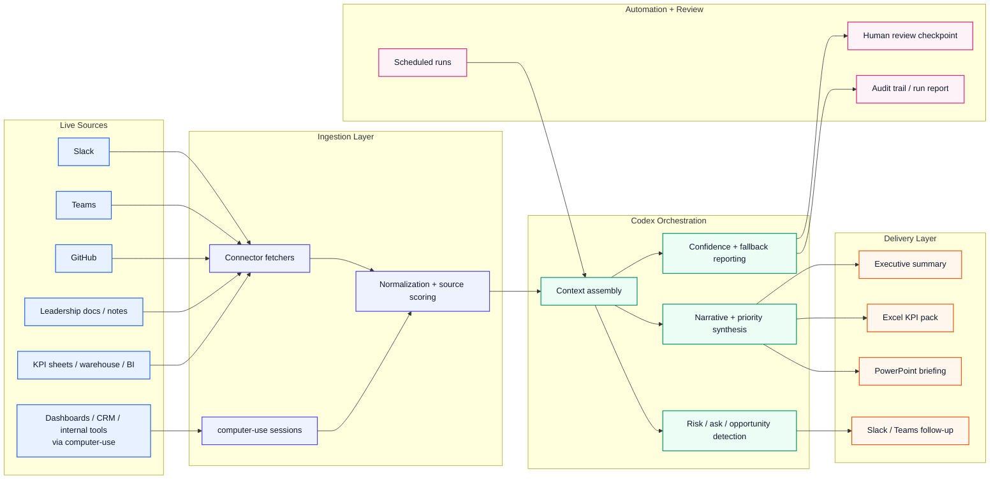

# Architecture

This repo now has three meaningful architecture states:

1. the **original sample-input prototype**
2. the **current hybrid live demo**
3. the **target fully integrated workflow**

That distinction matters because the repo is no longer just a concept package. It now has a real hybrid business workflow running on top of live Slack and GitHub.

## 1. Original sample-input prototype

This was the first working shape of the `Executive Briefing Machine`.

## 2. Current hybrid live demo

This is the architecture the repo actually implements today.

## 3. Target fully integrated workflow

This is the expanded version if every meaningful source becomes live.

## What is real today

- live Slack ingestion
- live GitHub ingestion
- curated KPI data
- curated leadership framing
- scheduled execution path
- editable Excel and PowerPoint outputs

## What is still synthetic or incomplete

- KPI data is curated, not live from a source-of-truth system
- leadership framing is curated, not live from a thread or doc source
- Teams is not wired
- `computer-use` is only represented as a future path
- outbound delivery is not yet part of the live run

## Why the new middle diagram matters

The old “current prototype” versus “target architecture” split is no longer enough.

The repo now has a middle state that is the actual product story:

- not fully live
- not merely mocked
- a hybrid workflow with real connectors, curated business context, and real deliverables

That is the state most worth showing in a repo, article, or GitHub Pages landing page.
