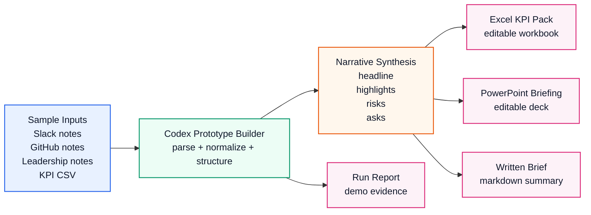
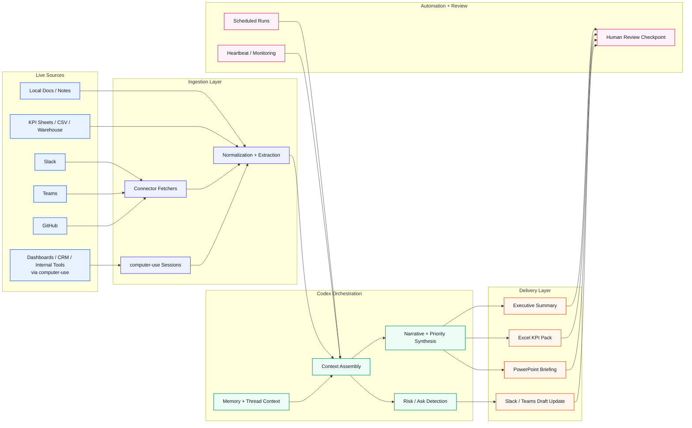

# Architecture

This repo currently contains two different architecture states:

- the **current prototype**, which runs end to end on sample local inputs
- the **integrated target architecture**, which adds live connectors, `computer-use`, and recurring automation

## Current Prototype

This is what exists in the repo today.

## Integrated Target Architecture

This is the expanded version if the prototype is wired to live sources.

## Why both diagrams matter

- The first diagram shows what is already real in this repo.
- The second diagram shows the credible next step without pretending it already exists.
- Together they make the maturity gap explicit: prototype today, connected workflow later.

## What Is Implemented Now

The repo now contains a partial build of the integrated architecture for the `Executive Briefing Machine`:

- `src/executive-briefing/adapters.mjs`
  Maps sample inputs into connector-ready adapter contracts for Slack, GitHub, KPI files, local notes, and a `computer-use`-aligned UI capture stub. It now also contains live Slack and live GitHub API adapters with sample fallbacks.
- `src/executive-briefing/pipeline.mjs`
  Assembles context, selects live-vs-sample adapters based on available credentials, and synthesizes the executive briefing narrative.
- `src/executive-briefing/artifacts.mjs`
  Generates native editable Excel and PowerPoint artifacts.
- `scripts/run_scheduled_executive_briefing.mjs`
  Provides a schedule-friendly entrypoint that refreshes the full demo output set from the same orchestration layer.
- `tests/executive-briefing.test.mjs`
  Verifies sample ingestion, live Slack ingestion, live GitHub ingestion, synthesis, and artifact generation end to end.

## Mapping To Current Codex Features

- Slack: represented by a live `conversations.history` adapter path plus a sample fallback for demos
- GitHub: represented by a live repository API adapter path plus a sample fallback for demos
- `computer-use`: represented by the UI-capture adapter stub for dashboard-only systems
- native `Excel`: used for the KPI workbook output
- native `PowerPoint`: used for the executive briefing deck
- automations: represented by the reusable scheduled runner entrypoint and the Codex automation that can call back into this workspace

## Remaining Work For The Full Target

- add a real `computer-use` capture path for dashboard and portal extraction
- add Teams ingestion and outbound delivery adapters
- connect KPI ingestion to a warehouse export or BI source instead of only local CSV files
